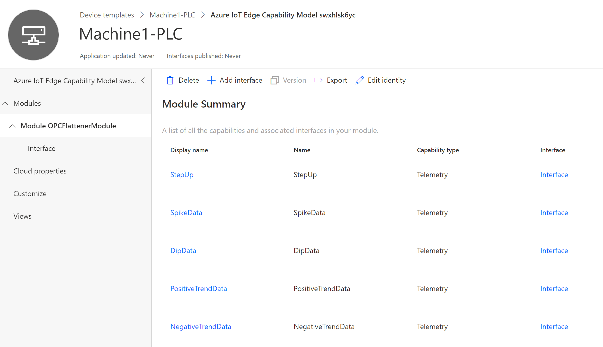
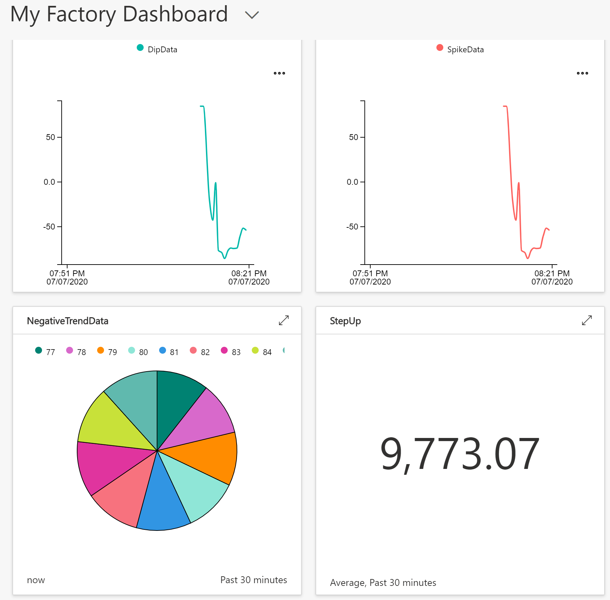

# Smart Factory Accelerator

This accelerator provides resources to get started with Smart Factory Solutions. The goal of this sample is to showcase how to use fully managed services and serverless components to reduce time to value and infrastuructre management for Industrial IoT architectures.

- Condition based monitoring Solution

- Anomaly Detection Solution

- Quality Prediction Solution

- Edge Analytics Solution

- <TODO...>

## Condition based monitoring Solution

### Getting Started Guide

#### 1. Setup IoT Central

- Create an [IoT Central App](https://docs.microsoft.com/en-us/azure/iot-central/core/quick-deploy-iot-central)

- Create a [Device Template from an IoT Edge manifest](https://docs.microsoft.com/en-us/azure/iot-central/core/tutorial-add-edge-as-leaf-device#create-device-template) using the `edgeDeploymentManifest.json` file.

- Delete the `OPCPublisher` Modules

- Add a Custom Interface with 5 telemetry capabilites as shown below:

- Save and Publish the Template.

- Add a new [IoT Edge Device](https://docs.microsoft.com/en-us/azure/iot-central/core/tutorial-add-edge-as-leaf-device#add-iot-edge-device) using the above Template and get the device credentials.

#### 2. Setup IoT Edge

- Deploy [IoT Edge on your device manually](https://docs.microsoft.com/en-us/azure/iot-edge/how-to-install-iot-edge-linux#install-iot-edge-and-container-runtimes) or use an [Azure IoT Edge-enabled Linux VM](https://docs.microsoft.com/en-us/azure/iot-central/core/tutorial-add-edge-as-leaf-device#deploy-an-iot-edge-device) as shown in the tutorial.

- Create a folder `opcconfigs` in the root of the IoT Edge VM and copy all files from `opcconfigs` folder to it.
    - `publishednodes.json` file contains the OPC Server EndpointUrl and OpcNodes used by the `OPCPublisher` module to collect the data.
    - `mapping.json` file contains DisplayName mapping used by the `OPCFlattenerModule` module to tranform the message sent to IoT Central. 
    - The `opcconfigs` folder in the VM is mapped to the IoT Edge container using the `Binds` in the deployment manifest file.

- [Configure the IoT Edge VM](https://docs.microsoft.com/en-us/azure/iot-central/core/tutorial-add-edge-as-leaf-device#configure-the-iot-edge-vm) to use the DPS symmetric key provisioning

- Make sure to restart the iotedge and verify the running modules using `sudo iotedge list`:

<PRE>
NAME                STATUS           DESCRIPTION      CONFIG
edgeHub             running          Up 11 seconds    mcr.microsoft.com/azureiotedge-hub:1.0
OPCPublisher        running          Up 9 seconds     mcr.microsoft.com/iotedge/opc-publisher:latest
OPCFlattenerModule  running          Up 6 seconds     jomit/opcflattenermodule:0.0.4-amd64
edgeAgent           running          Up 15 seconds    mcr.microsoft.com/azureiotedge-agent:1.0
</PRE>

#### 3. Setup OPC Server

- For this sample we will start a [simulated OPC PLC Server](https://github.com/Azure-Samples/iot-edge-opc-plc) running inside a docker container on the IoT Edge VM:

    - `sudo docker run --rm -it -p 50000:50000 --name="opcplc" --network="azure-iot-edge" --hostname="opcplc" mcr.microsoft.com/iotedge/opc-plc --autoaccept`

#### 4. View Telemetry in the Dashboard

- [Create a new Dashboard](https://docs.microsoft.com/en-us/azure/iot-central/core/howto-add-tiles-to-your-dashboard) and add the tiles for relevant tags: 

#### 5. Setup Alerts

- <TODO...>

## Resources

- [Tutorial: Add an Azure IoT Edge device to your Azure IoT Central application](https://docs.microsoft.com/en-us/azure/iot-central/core/tutorial-add-edge-as-leaf-device)

- [Power BI solution for Azure IoT Central V3](https://appsource.microsoft.com/en-us/product/web-apps/iot-central.power-bi-solution-iot-central)