# Build Custom Module "OPCFlattener"

Table of contents
1. [Install Docker desktop](#install-docker-desktop)
2. [Open OPCFlattener project in Visual Studio](#open-opcflattener-project-in-visual-studio)
3. [Make sure to install the necessary packages](#make-sure-to-install-the-necessary-packages)
4. [Get the connection string for the IoT Edge device](#get-the-connection-string-for-the-iot-edge-device)
5. [Setup the connection string in Visual Studio](#setup-the-connection-string-in-visual-studio)
6. [Run the IoT Edge Simulator and test it](#run-the-iot-edge-simulator-and-test-it)
7. [Build the docker image](#build-the-docker-image)
8. [Push the docker image to the registry](#push-the-docker-image-to-the-registry)
    * [Update module.json](#update-module.json)
    * [Build and push the IoT Edge module](#build-and-push-the-iot-edge-module)
9. [Miscellaneous](#miscellaneous)
    * [Not receiving messages at "IoT Hub module client"](#not-receiving-messages-at-iot-hub-module-client)
    * [How to find the URL to use](#how-to-find-the-url-to-use)
    * [Push to Docker repository fails](#push-to-docker-repository-fails)

# Install Docker desktop

Follow the instructions in the below link to install Docker desktop <br>
https://docs.docker.com/docker-for-windows/install/ <br>
Make sure Docker is up and running, a small whale icon will appear in your task bar

# Open OPCFlattener project in Visual Studio

Navigate to the folder "modules/OPCFlattener" and double click OPCFlattener.csproj, click on the Program.cs

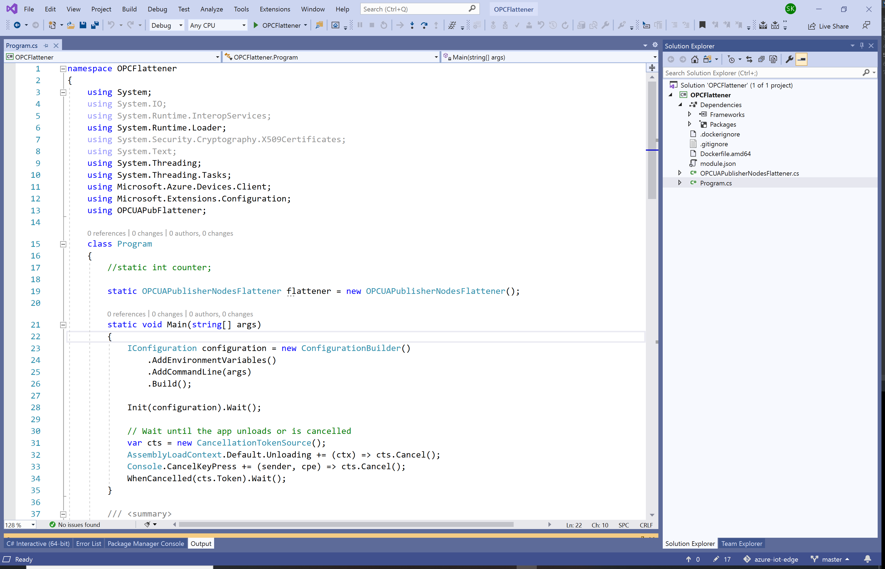

# Make sure to install the necessary packages

Click _Extensions_ and _Manage Extensions_ from the menu

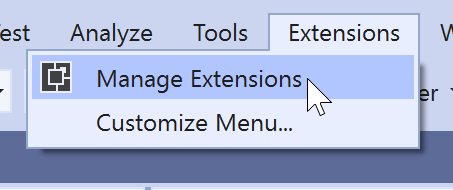

Check that following extensions are installed
* Azure IoT Edge Tools for VS 2019
* Cloud Explorer for for VS 2019 Preview

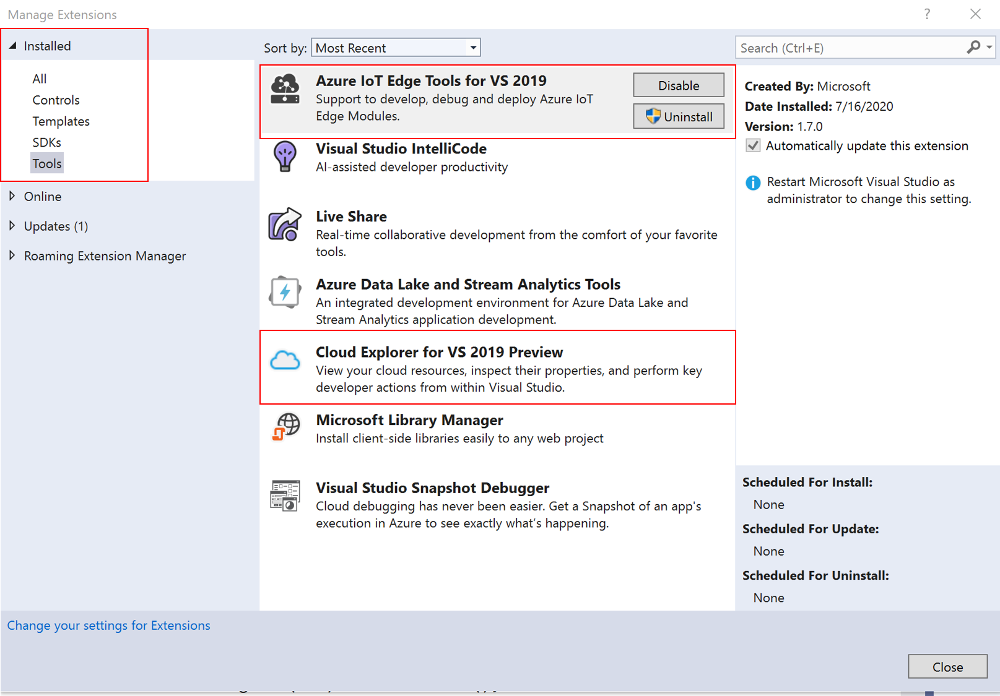

If the extensions are not listed then click _online_ option and then search for the extensions and install them.<br> 
**Note**:in order to install the extensions Visual Studio needs to be closed and restarted.

If you run the program you will get the following error

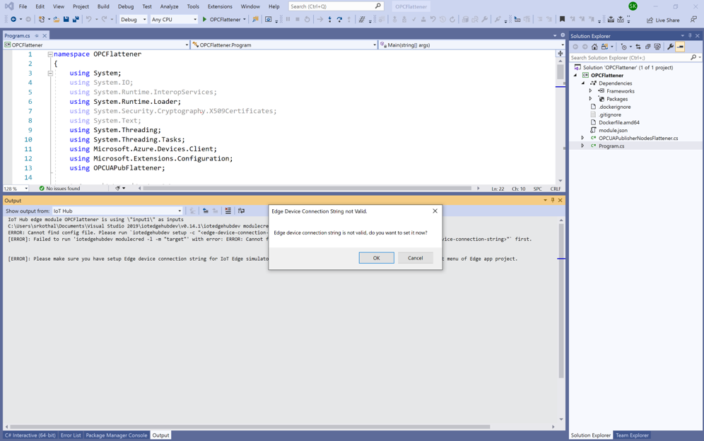

# Get the connection string for the IoT Edge device

Use any IoT Hub, add an IoT Edge device and get the connection string

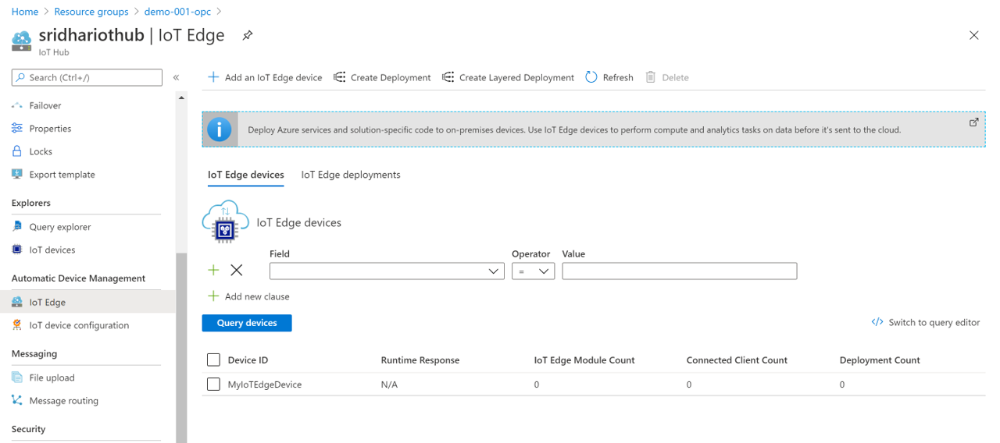

Select the newly created edge device "MyIoTEdgeDevice" and get the primary connection string
 
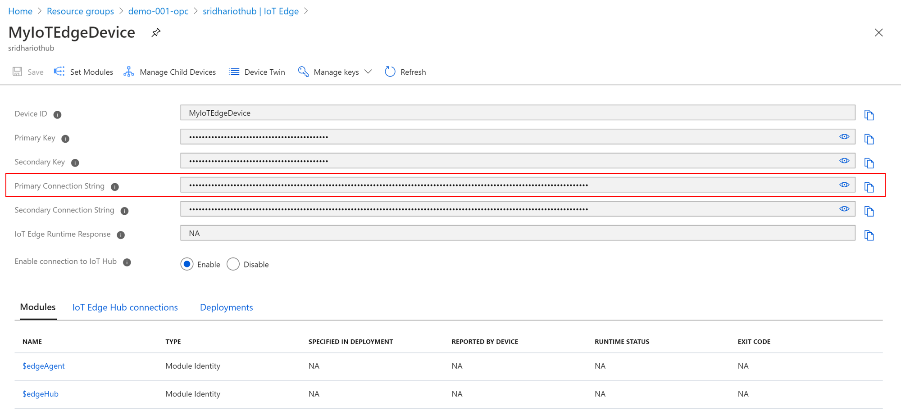

# Setup the connection string in Visual Studio

Open Tools -> Azure Iot Edge Tools -> Setup Iot Edge Simulator

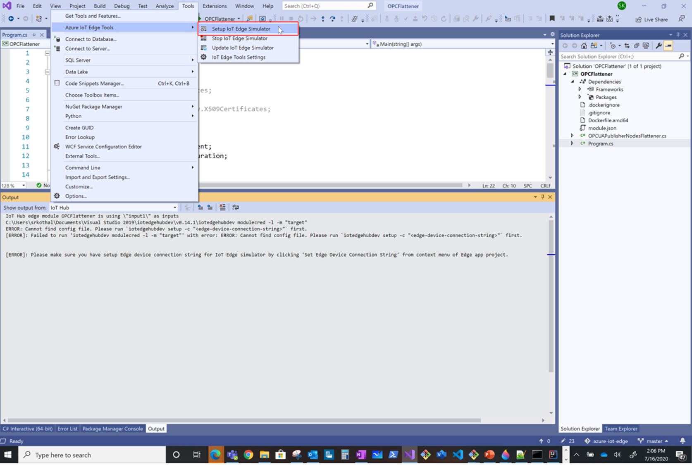

Copy the connection string from Azure portal and enter it in Visual Studio 

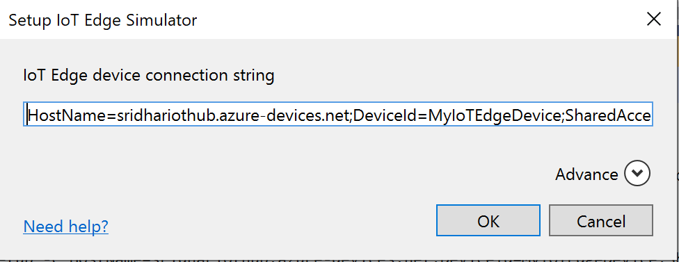

You should see a "Setup IoT Edge Simulator successfully" in Visual Studio Output panel

# Run the IoT Edge Simulator and test it

From a Bash shell execute the following command
```
curl --header "Content-Type: application/json" --request POST --data '{"inputName": "input1","data":"hello world"}' http://localhost:53000/api/v1/messages
```
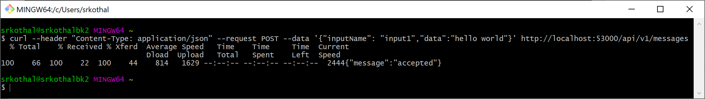

Notice a "Received message sent" in the edge console

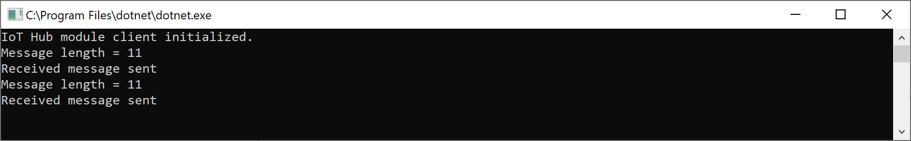

# Build the docker image

Run the below command in the "OPCFlattener" folder <br>
**Note**: Change the registry name "sridharcontainerregistry.azurecr.io" in the below command with your container registry 
name.
```
docker build -t sridharcontainerregistry.azurecr.io/opcflattener:1.0 -f Dockerfile.amd64 .
```
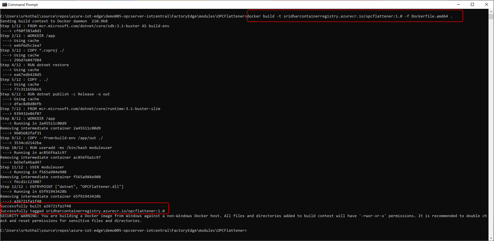

List the images to check if the image got added to your local repository


# Push the docker image to the registry

Open the "FactoryEdge" folder in Visual Studio Code and make few changes

### Update module.json
In module.json file update the image "repository" with your docker username (i.e docker login username)
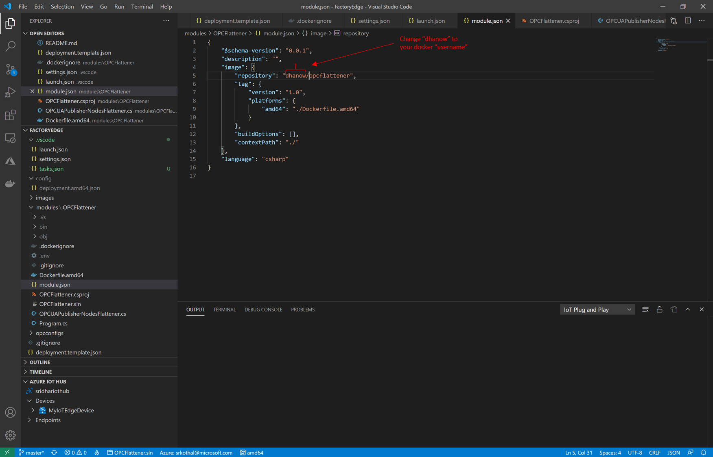

### Build and push the IoT Edge module

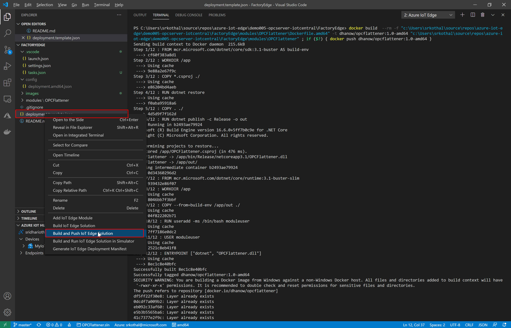

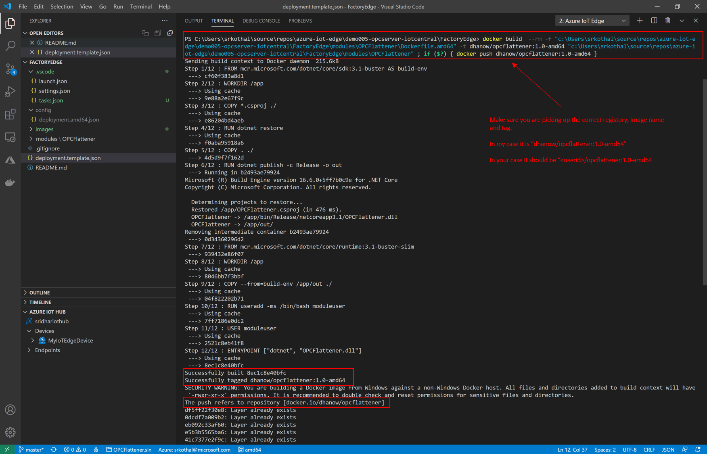

# Miscellaneous

### Not receiving messages at "IoT Hub module client"
1. Stop the simulation **Tools -> Azure IoT Edge Tools -> Stop IoT Edge Simulator**
2. Close Visual Studio
3. Restart you work station

### How to find the URL to use
Run Visual Studio in non-debug mode **Debug->Start without debugging**

### Push to Docker repository fails
1. From the Visual Studio Code Terminal, login to Docker using the below command
    ```
    docker login -u <username>
    ```
2. Make sure to edit "module.json" and update the "repository" 


